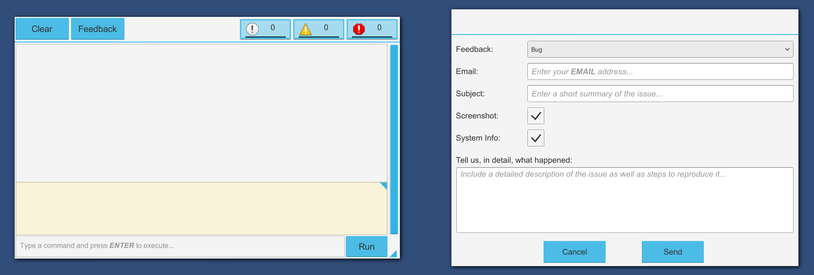
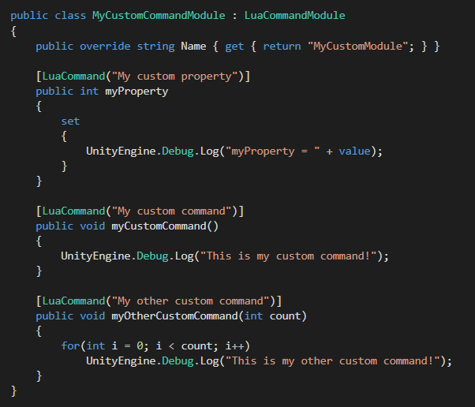
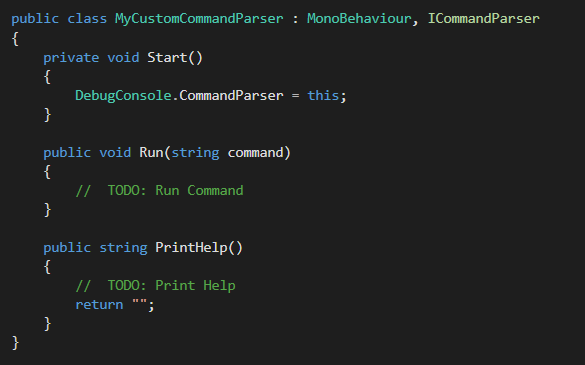
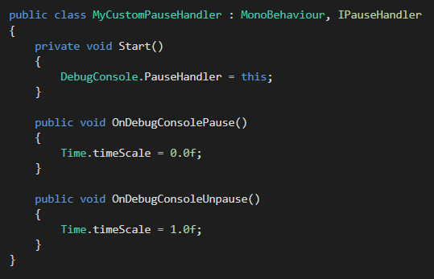
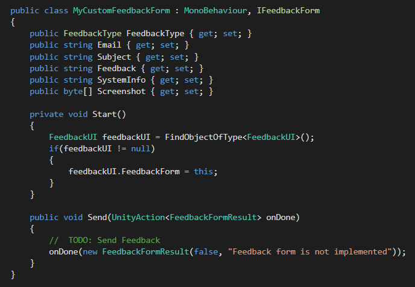

# Introduction
This plugin allows you to view debug messages in-game, in a build. In addition it also allows you to execute commands(using a Lua parser) and comes with a bult-in bug report tool.

# Requirements
Unity 5.6 or newer. If you decide to use the Lua command parser the platofrm you aim to publish on must be supported by [MoonSharp](http://www.moonsharp.org/unitytips.html).

# Installation
* Clone or download the repository to your computer.
* The repository contains a Unity project. Open the project in Unity.
* Export everything in the *Assets* folder as a *.unitypackage* file. If you don't want or don't need the Lua command parser uncheck the following folders in the export window: *Console/Addons/LuaCommandParser* and *Plugins*.
* Import the *.unitypackage* file into your project.

Note: The ***Examples*** folder is optional and can be discarded when you export the Unity package.

# How To
## Add the console to your game
Simply drag & drop the prefab into your first scene and enable **Dont Destroy On Load** in the inspector. The prefab is located in *Assets/Console/Resources/DebugConsole*.

The debug console will automatically pick up calls to ***UnityEngine.Debug.Log*** so you don't need to write any code.

## Open and close the console
To open and close the console press "~" on your keyboard. The key can be changed in the inspector(on the **Toggle Debug Console On Key** component).

To open and close the console from a script call **DebugConsole.Open()** and **DebugConsole.Close()**.

If you want to temporarily lock the console(e.g. during a loading screen) call **DebuConsole.Lock()** and **DebugConsole.Unlock()**. While locked the console will not respond to user input.

## Write custom commands
If you decided to keep the Lua command parser you can add new commands as follows:
* Create a new C# class that inherits from **LuaCommandModule**.
* For each command create a method that returns **void** and has any number of parameters of type: **int**, **float**, **bool** or **string**.
* To display your custom commands when you type **help** in the console add the **LuaCommand** attribute to each command method.

## Write a custom command parser
To use a custom command parser create a script that inherits from **ICommandParser** and assign an instance of it to **DebugConsole.CommandParser**. Attach the script to the debug console game-object.

## Pause the game when the console opens
If you want to pause the game when the console opens create a script that inherits from **IPauseHandler** and assign an instance of it to **DebugConsole.PauseHandler**. Attach the script to the debug console game-object.

Additionally, you can use the built-in class **GenericPauseHandler**.

If you don't want to pause the game but want to disable player input, for example, subscribe to the **DebugConsole.Opened** and **DebugConsole.Closed** events.

## Use the bug report tool
To use the bug report tool you'll need to implement you own custom feedback form that can upload the data to a private server. **Web programming knowledge is required.**

To create a custom feedback form create a script that inherits from **IFeedbackForm** and assign an instance of it to **FeedbackUI.FeedbackForm**. Attach the script to the debug console game-object.

An example feedback form is available that can send the data to [Google Forms](https://support.google.com/docs/answer/6281888).

# License
This software is released under the [MIT license](http://opensource.org/licenses/MIT). You can find a copy of the license in the LICENSE file included in the repository.